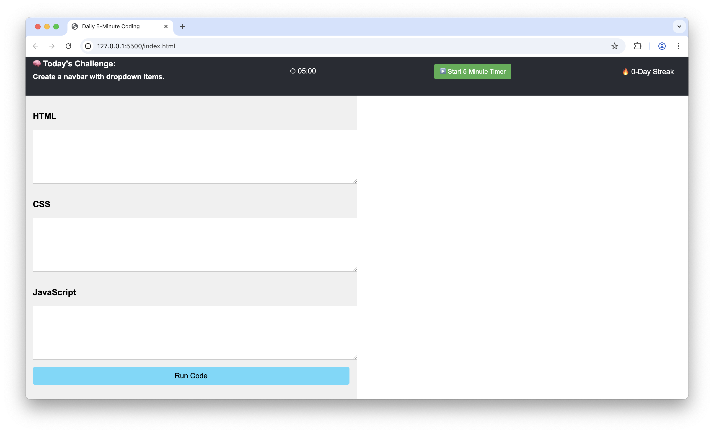

# Daily 5-Minute Coding Challenges

**Daily 5-Minute Coding Challenges** is a personal micro-product that helps you overcome procrastination in learning web development by giving you a **random 5-minute HTML/CSS/JS challenge each day**, along with a live coding environment and streak tracker.

---

## 🎧 Built with Vibe Coding

This entire project was created through **vibe coding** —  
> flowing with creativity, intuition, and momentum rather than strict rules.

It's not about perfect code. It's about building something that solves a real micro problem:  
**procrastination in learning web development**.

---

## 🚀 Features

- 🎯 **One small coding challenge per day** (HTML/CSS/JS focused)
- ⏱️ **5-minute countdown timer** to start manually
- 🖊️ **Split-screen layout** with code editor and live preview
- 🔥 **Streak tracker** to track your daily completions
- 🧠 **Local storage** remembers your progress and today's challenge
- ✅ Minimal and distraction-free interface

---

## 🖼️ Preview
[Live](https://yaoolee.github.io/five-minute-coding-habit/)

---

## 🧠 How It Works

1. When you load the site, it shows **one random challenge for the day**.
2. You can write HTML, CSS, and JavaScript on the left side.
3. Click **“Run Code”** to see the result on the right side and log your daily streak.
4. Use the **“Start 5-Minute Timer”** button to time your focus session.
5. The **streak counter** increases if you run code daily without skipping.

---

## ✅ Technologies Used

- HTML
- CSS
- JavaScript 
- `localStorage` for saving progress and streak

---

## 📦 How to Use

1. **Clone this repository** or download the `index.html` file.
2. Open `index.html` in any browser.
3. Click **“▶️ Start 5-Minute Timer”** to begin your coding challenge.
4. Solve the task, click **“Run Code”**, and see the results live.
5. Come back every day to build a streak!

---

## 🙌 Made with focus, for building focus.
